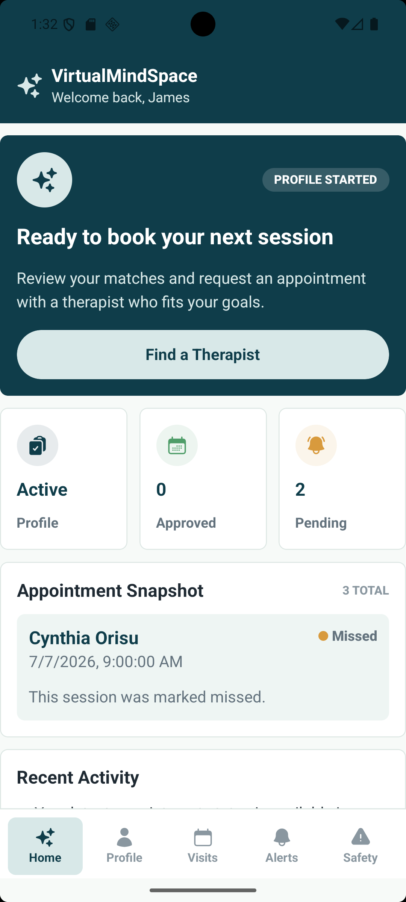
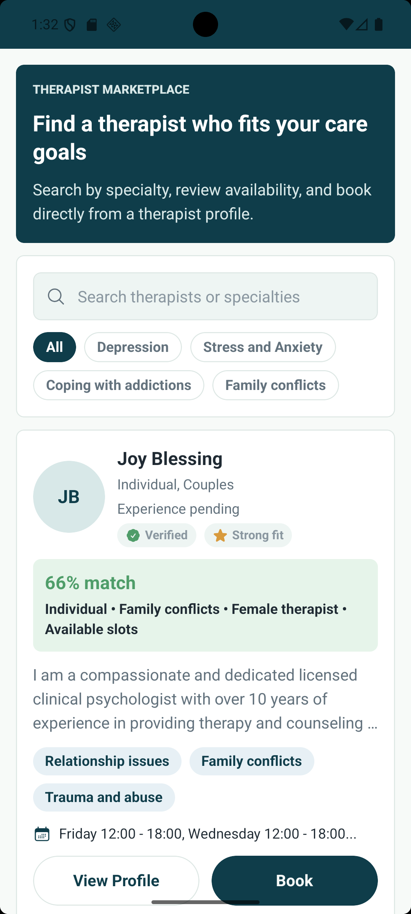
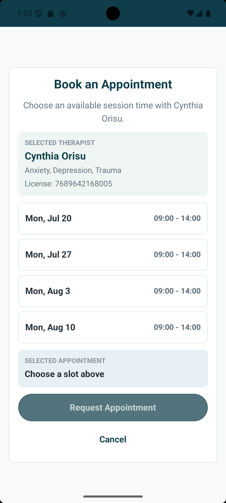
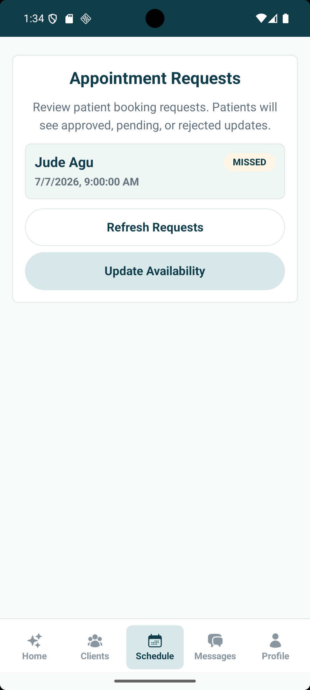
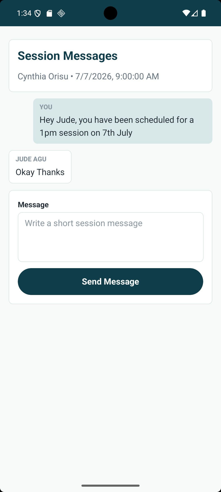
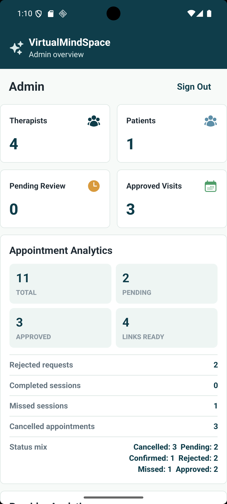

# Teletherapy App

Teletherapy App is an Expo React Native mobile app for connecting patients with therapists, booking appointments, managing session communication, and supporting therapist verification through an admin workflow. The app uses Firebase Authentication for account identity, Cloud Firestore for role-based data, and Expo Notifications for appointment and message updates.

[](https://expo.dev/)
[](https://reactnative.dev/)
[](https://www.typescriptlang.org/)

## Highlights

- Patient, therapist, and admin role-based navigation
- Firebase email/password authentication and Google sign-in
- Patient onboarding and therapist matching flow
- Appointment booking based on therapist availability
- Appointment status tracking for pending, approved, rejected, cancelled, completed, and missed sessions
- Real-time appointment-specific session messaging
- Push notification setup with Expo Notifications
- Therapist availability and profile management
- Admin dashboard for therapist verification and platform oversight
- Shared UI components for screens, cards, buttons, inputs, loading states, empty states, and error states
- TypeScript models for users, appointments, messages, notifications, availability, and navigation

## Video Demo

Demo video link can be added here.

## Android Build

Expo build link can be added here.

## Screenshots

Add screenshots to a `screenshots/` folder and update the image paths below.

<p>
  
  
  
</p>

<p>
  
  
  
</p>

## Tech Stack

- Expo SDK 56
- React Native 0.85
- TypeScript
- React Navigation
- Firebase Authentication
- Cloud Firestore
- Google Sign-In
- Expo Notifications
- Expo Dev Client
- NativeWind
- EAS Build

## Architecture

```text
Expo Mobile App
      |
      +-> Firebase Authentication
      +-> Cloud Firestore
      |      +-> users
      |      +-> patients
      |      +-> therapists
      |      +-> appointments
      |      +-> messages
      |      +-> notifications
      |
      +-> Expo Notifications
      +-> Role-based navigation
             +-> Patient workspace
             +-> Therapist workspace
             +-> Admin workspace
```

- Firebase Authentication owns sign-in and account identity.
- Cloud Firestore stores user profiles, therapist records, patient records, appointments, messages, and notifications.
- The root navigator resolves the signed-in user's role and opens the correct workspace.
- Appointment services handle booking, status updates, and related notifications.
- Messaging services subscribe to appointment-specific conversations in real time.
- Admin services support therapist verification and dashboard activity summaries.

## Project Structure

- `admin/` - admin dashboard and therapist verification screens
- `components/` - shared reusable UI components
- `config/` - Firebase and Google authentication configuration
- `navigation/` - auth, root, patient, therapist, and admin navigators
- `patients/` - patient appointment, matching, profile, questionnaire, and notification screens
- `screens/` - shared auth, home, messaging, safety, and profile screens
- `services/` - Firebase service modules for app data operations
- `therapist/` - therapist clients, messages, schedule, availability, questions, and profile screens
- `theme/` - theme provider and styling utilities
- `types/` - TypeScript domain models, env types, asset types, and navigation types

## Getting Started

### 1. Install Dependencies

```bash
npm install
```

### 2. Configure Environment Variables

Create a `.env` file in the project root:

```env
REACT_APP_FIREBASE_API_KEY=your_api_key
REACT_APP_FIREBASE_AUTH_DOMAIN=your_project.firebaseapp.com
REACT_APP_FIREBASE_PROJECT_ID=your_project_id
REACT_APP_FIREBASE_STORAGE_BUCKET=your_project.appspot.com
REACT_APP_FIREBASE_MESSAGING_SENDER_ID=your_messaging_sender_id
REACT_APP_FIREBASE_APP_ID=your_app_id
REACT_APP_FIREBASE_MEASUREMENT_ID=your_measurement_id
REACT_APP_GOOGLE_ANDROID_CLIENT_ID=your_android_google_client_id
REACT_APP_GOOGLE_IOS_CLIENT_ID=your_ios_google_client_id
REACT_APP_GOOGLE_WEB_CLIENT_ID=your_web_google_client_id
```

Android builds also require:

```text
google-services.json
```

### 3. Start the App in Development

Start Expo:

```bash
npm start
```

This app uses native modules such as Google Sign-In, notifications, and Firebase configuration, so native testing should use a custom Expo development client when needed.

Start with an Expo development client:

```bash
npm run start:dev-client
```

Run on Android:

```bash
npm run android
```

Run on web:

```bash
npm run web
```

## Available Scripts

```bash
npm start
npm run start:dev-client
npm run start:dev-client:clear
npm run android
npm run android:dev-client
npm run ios
npm run web
npm run typecheck
```

## Firebase Setup

The app expects Firebase Authentication to be configured for:

- Email/password sign-in
- Google sign-in

The app uses Cloud Firestore collections for:

- `users`
- `patients`
- `therapists`
- `appointments`
- `messages`
- `notifications`

## Notifications

The app registers users for push notifications after their role is resolved. Notifications are used for appointment requests, appointment status changes, and new session messages.

Android notification configuration is defined in `app.json`.

## TypeScript Migration

This project was migrated from JavaScript to TypeScript as part of an engineering cleanup. The app now includes typed React Native screens, Firebase service modules, navigation route contracts, shared UI component props, and domain models for core app data.

## Quality Checks

Run type checking before sharing or building the app:

```bash
npm run typecheck
```

The TypeScript config enables stricter checks including `noImplicitAny`, `noImplicitReturns`, `noUncheckedIndexedAccess`, `noFallthroughCasesInSwitch`, and consistent file-name casing.

## Portfolio Notes

This project demonstrates:

- Role-based mobile app navigation
- Firebase Authentication and Firestore integration
- Patient and therapist healthcare workflows
- Appointment booking and status management
- Real-time appointment messaging
- Push notification setup
- Admin review and verification tooling
- Reusable React Native component architecture
- TypeScript migration and maintainable app contracts

## Future Improvements

- In-app video session integration
- Calendar sync for appointments
- Therapist search filters and specialties
- Payment support for paid sessions
- Production notification templates and deep links
- Expanded admin analytics
